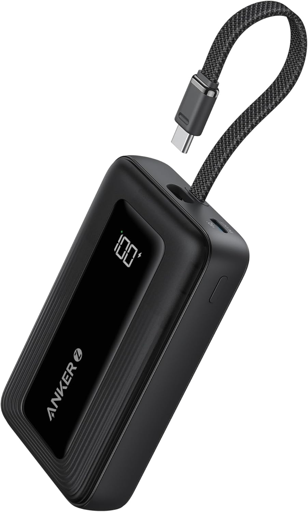
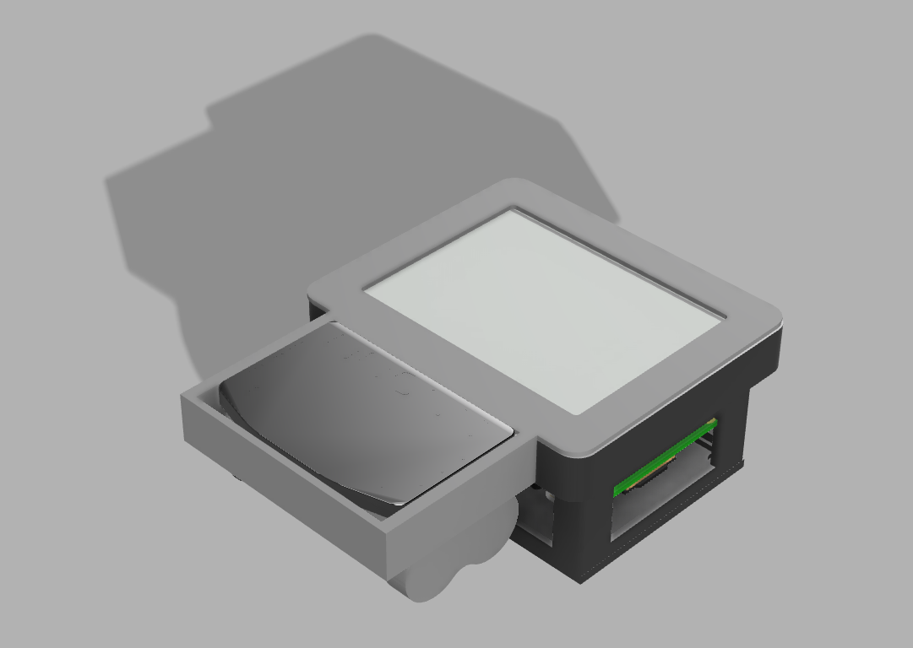
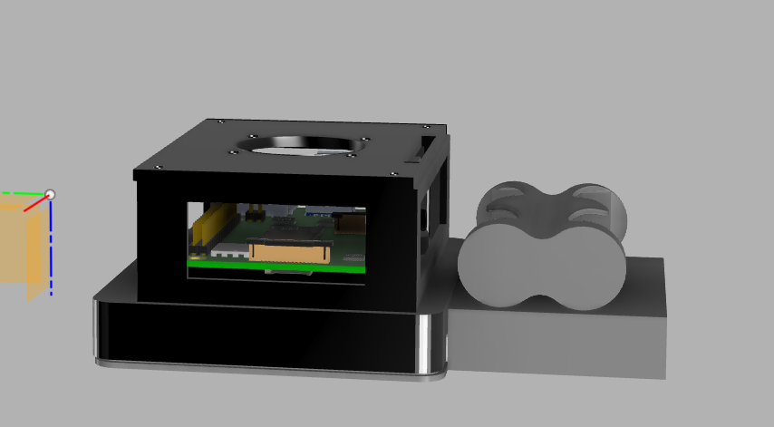
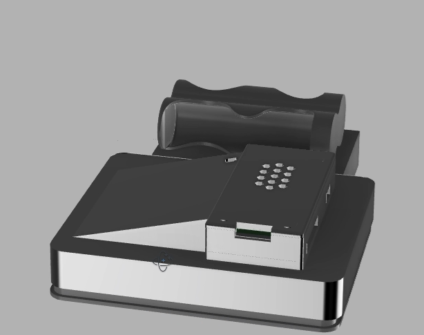
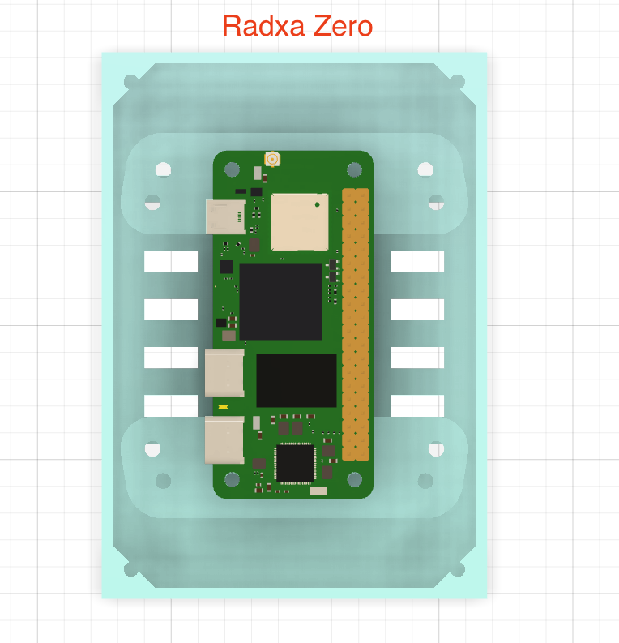

# HackSlate Pi

## Overview
I got interested in the HackerBerry Pi builds a while back, but they never seem to be in stock and I do not want to be locked into just the CM5 version. This repo is my take on a portable slate that keeps the hackerberry-style keyboard experience while letting me mix and match compute modules.

The thicker frame version currently supports:
- Radxa Zero
- Radxa CM5
- Raspberry Pi Zero
- Raspberry Pi 3 / 4 / 5B
- Orange Pi 3
- Orange Pi 2

I do not have every board in that list, so if you get another SBC working please open a PR and add your notes.

All STLs plus the native FDZ design files are open-sourced here for anyone who wants to remix or do deeper edits.

## Display
Right now this build uses the Waveshare 4.2" color e-ink module. I recently discovered a Reddit post by [Least_Assumption5490](https://www.reddit.com/r/cyberDeck/comments/1pfusk4/fastrefresh_eink_raspberrypi_terminal_demo_new/) that shows a high-refresh terminal-friendly display, so I will probably switch over to that panel soon for faster UI updates.

## Keyboard
Any of the HackerBerry Pi keyboards will drop into this chassis. They are still on sale and can be found through the HackerBerry Pi GitHub repos, so pick up whichever variant you prefer.

## Power

I plan to power the build with this [Anker Power Bank](https://www.amazon.com/Anker-Portable-Charger-Charging-Battery/dp/B0CZ9M6X8Q/). It avoids designing an internal 18650 charging circuit and stays compact. This pack should be fine for Raspberry Pi 3 or 4 builds; Pi 5 needs more headroom, so treat this as a Pi 3/4 power solution.

## Demos
- [HackSlate full Raspberry Pi 3d print animation](https://youtu.be/X0gvL5FtIqs)
- [HackSlate Radxa Zero / Pi Zero 3d print animation](https://youtu.be/aj6KT-1gvdg)

## Gallery

## Contributing
If you test new boards, make display tweaks, or remix the case geometry, please document what you changed and open a PR so everyone else can benefit.

### TODO
- Confirm Radxa Zero compatibility with the e-ink display stack and document the working wiring/software setup.
